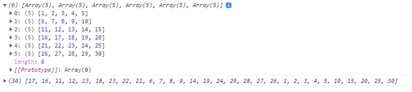
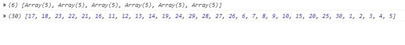
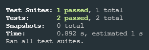

<h1 align="center"> Highlights: </h1>

<h2 align="center"> Task # 1 </h1>

  First step to left: 
  

  First step to right:
  

<!-- TABLE OF CONTENTS -->
<h2 id="table-of-contents"> :book: Table of Contents</h2>

  
Table of Contents

  <ol>
    <li><a href="#task1"> ➤ Task 1: Iterate array spirally </a></li>
  </ol>

<!-- TASKO1 -->
<h2 id="task1"> :small_orange_diamond: Task 1: Iterate array spirally </h2>

I created a function, that generates matrix and iterates all it's elements spirally in clockwise order.

You're able to:

<ul>
  <li>Set a number of <code> rows </code> and <code> cols </code> of matrix.</li>
  <li>Set a starting point of iteration, by modifying <code> startingRow </code> and <code> startingCol </code> of matrix.</li>
  <li>Set a starting direction of iteration, by modifying <code> firstStepDirection </code>.</li>
  
You're able to choose "left" (<code> firstStepDirectionLeft </code>) or "right" (<code> firstStepDirectionLeft </code>).

</ul>

 :exclamation: I could also modify the function and make it iterate in counterclockwise manner, but it wasn't in technical assignment.

Function with basic parameters looks like this:

<pre><code> function iterate2dArraySpirally(rows = 6, cols = 5, startingRow = 4, startingCol = 2, firstStepDirection = firstStepDirectionLeft) {}</code></pre>

<h2> Results </h2>

 First step to left: 

  

 First step to right: 

  

<h3> :small_orange_diamond: Tests: </h3>

 
  I decided to make unit testing of code and used <b><i>Jest</i></b> for this purpose.
  I also installed <b><i>babel</i></b> and <b><i>@babel/preset-env</i></b> to work with modules (it transpiles ES6 module to CommonJS module).

 :microscope: Tests results: 

  

