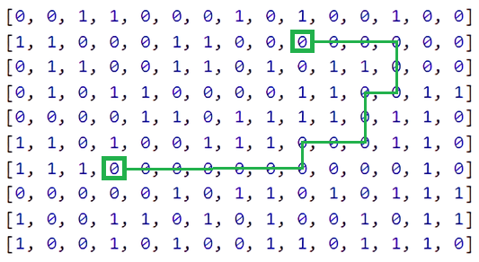
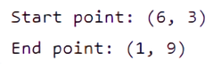
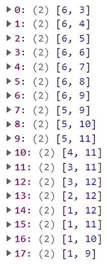

<h1> :small_orange_diamond: Task 3: Find Path In Matrix </h1>

 I created a function, that generates a matrix and searches for path between it's two random cells. 

 You're able to: 

<ul>
  <li> Set a number of <code> rows </code> and <code> cols </code> of matrix. </li>
  <code> Note: It's better to set a number of rows and cols to 4 or more. </code>
</ul>

 Function with basic parameters: 

<pre><code> const findPath = (rows = 10, cols = 15) => {} </code></pre>

<h2> Results </h2>

 Starting cell is (6, 3), ending cell is (1, 9) 

  

  
 Details 

  
 Matrix: 

  

    
  

  
 Cells: 

  

    
  

  
 Path: 

  

    
  

 
  Great Success!

