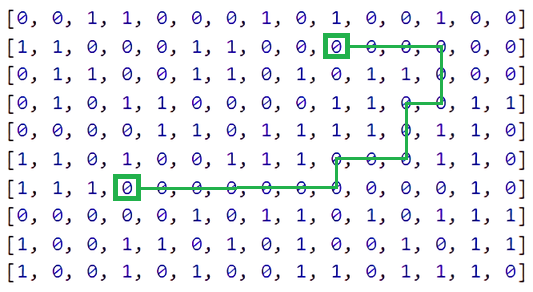

<h1 align="center"> Welcome to my Lektorium repo: </h1>

<!-- TABLE OF CONTENTS -->
<h2 id="table-of-contents"> :book: Table of Contents</h2>

 Use links to navigate through tasks: 

<ol>
  <li>
    <a href="https://github.com/solar-citizen/lektorium/tree/task1"> ➤ Task 1: Matrix Spiral Iteration </a>
    

      
 Click to see result 

      
 First step to left: 

      

        
      

      
 First step to right: 

      

        
      

    

  </li>

  <li>
    <a href="https://github.com/solar-citizen/lektorium/tree/task2"> ➤ Task 2: Drag & Drop </a>
    

      
 Click to see result 

      

        
      

    

  </li>

  <li>
    <a href="https://github.com/solar-citizen/lektorium/tree/task3"> ➤ Task 3: Find Path In Matrix </a>
    

      
 Click to see result 

      
 Matrix With Path: 

      

        
      

    

  </li>

</ol>
