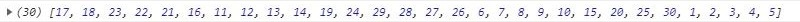

<!-- TASKO1 -->
<h1 id="task1"> :small_orange_diamond: Task 1: Matrix Spiral Iteration </h1>

I created a function, that generates matrix and iterates all it's elements spirally in clockwise order.

You're able to:

<ul>
  <li>Set a number of <code> rows </code> and <code> cols </code> of matrix.</li>
  <li>Set a starting point of iteration, by modifying <code> startingRow </code> and <code> startingCol </code> of matrix.</li>
  <li>Set a starting direction of iteration, by modifying <code> firstStepDirection </code>.</li>
  
You're able to choose "left" (<code> firstStepDirectionLeft </code>) or "right" (<code> firstStepDirectionLeft </code>).

</ul>

Function with basic parameters looks like this:

<pre><code> const iterate2dArraySpirally = (rows = 6, cols = 5, startingRow = 4, startingCol = 2, firstStepDirection = firstStepDirectionLeft) => {}</code></pre>

<h2> Results </h2>

 First step to left: 

  

 First step to right: 

  

 
  Great Success!

